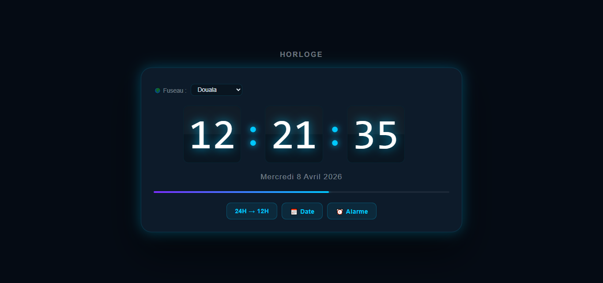

# TIPDA1_NgoungaFarida_Horloge
# Description
Ce projet est une application qui présente une horloge numérique en temps réel.
# Fonctionnalités
- Affichage de l'heure en temps réel,
- Gestion du format 12/24h,
- Création d'alarmes personnalisées,
- Affichage de la date,
- Interface utilisateur responsif
# Techonologies utilisées
- HTML,
- CSS,
- JavaScript
# Structure du projet
- Index.html (Structure de l'horloge)
- style.css (Design et mise en forme)
- script.js (Gestion des interactions)
# Utilisation
- Ouvrir le fichier Index.html dans un navigateur
- Interagir avec la page
# Aperçu

